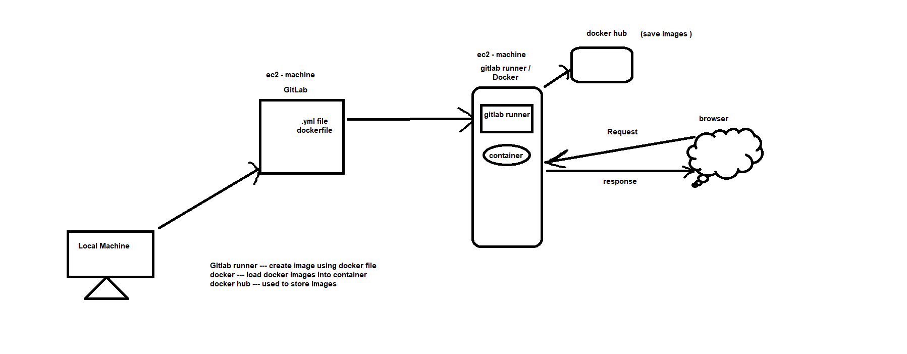
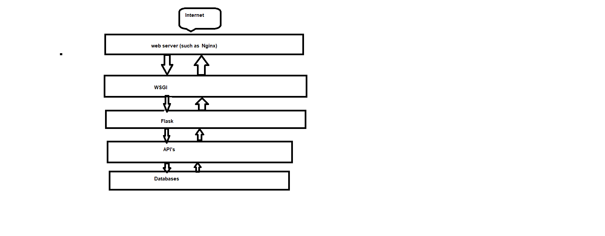

# CICD_repo

Prerequisite:

2 EC2 machine ( 1 for gitlab & 1 for docker & gitlab runner)
Sample Python project with .yml & docker file






Overview:

1. need to create 2 machine on aws 
2. need to install gitlab on 1 machine 
3. need to install docker & gitlab runner on 1 machine
4. need to create dockerfile & gitlab.yml file on project
5. need to setup final cicd setup on gitlab

Machine Setup:

Create & launch ec2-ubuntu machine on aws

We have many possibilities to connect Machines, here we can use the pem file or the Authentication user to connect EC2 Machine.
Edit security group & add new (inbound traffic) -> give type & port -- All traffic & source (custom)-- 0.0.0.0/0

Using pem file:
Download pem file for above launch box
Open git bash from were you download pem file folder
Get ssh command from ec2 machine (ref-image)


Default user - ubuntu

Method-2 - adding auth to user and connecting using user:

https://www.serverkaka.com/2018/08/enable-password-authentication-aws-ec2-instance.html 


Installing Gitlab 

Please refer to the following article (step-1,2,3)-- https://www.howtoforge.com/tutorial/how-to-install-and-configure-gitlab-on-ubuntu-1804/

create the gitlab password by default root user ->

> cd /opt/gitlab/bin
> sudo gitlab-rake 'gitlab:password:reset[root]'

now login into gitlab using - http://<ip>/ with changed password and root user

now create Repo on gitlab and sample python project and push to gitlab:
Sample Project structure:

your_code_folder
.gitlab-ci.yml
dockerfile
requirement.txt
<start_file>.py

Installing Docker 

Please refer to the following article (step-1,2)-- https://www.digitalocean.com/community/tutorials/how-to-install-and-use-docker-on-ubuntu-20-04

Installing Gitlab Runner

Now we installing gitlab runner on same docker machine or if you want to use separate machine then create new ec2 machine

To installing gitlab runner, first Need to login into gitlab

Move to → setting>cicd>runner>show runner installation instructions (execute this commands on gitlab runner machine)

While executing,it takes to give url & token which you can get from your gitlab itself And tag_name* ( which we use in the .yml file) and select shell command.
After execution is done, just refresh the gitlab ( setting>cicd>runner) page then u can see -> Available specific runners.

If want to restart -> sudo gitlab-runner restart

That's it, Now add the above tag into ur .yml file and push the code repo, CI/CD will trigger your pipeline. 


Check docker container:


Accessing Application outside of instance / From internet


Issues:
When Ip changed,Need to change external url in gitlab.rb (/etc/gitlab/gitlab.rb) file and reconfigure and restart

sudo gitlab-ctl reconfigure
# all GitLab components
sudo gitlab-ctl start / stop /restart / status


when gitlab url changed, unable to push the code to remote from  local machine:


1 . ERROR: Job failed: prepare environment: exit status
Solution:
Removed _ > .bash_logout file at home/gitlab-runner

2 . When Gitlab IP Changes 

Then Need to clone again for development

Reconfigure gitlab runner commands on gitlab runner machine,by following above step - (https://docs.google.com/document/d/1za5SzZHYzQR7OOWhIhwnMqLY3U402A0qsyvLtsaauEo/edit#heading=h.ac0npgyrgh9f )


3 . Got permission denied 

while trying to connect to the Docker daemon socket at unix:///var/run/docker.sock: Post "http://%2Fvar%2Frun%2Fdocker.sock/v1.24/build?buildargs=%7B%7D&cachefrom=%5B%5D&cgroupparent=&cpuperiod=0&cpuquota=0&cpusetcpus=&cpusetmems=&cpushares=0&dockerfile=dockerfile&labels=%7B%7D&memory=0&memswap=0&networkmode=default&nocache=1&rm=1&shmsize=0&t=91778825345%2Fci_cd_python_flask_project-3&target=&ulimits=null&version=1": dial unix /var/run/docker.sock: connect: permission denied
ERROR: Job failed: exit status 1
Solution:
Connect with docker installed machine
Run -> sudo chmod 666 /var/run/docker.sock


4. Port mapping issue:

Due to this issue we can explore our application to outside instances, if we use proper port matching like below then can access our application thru outside instances. 

container port (8080) must be same in docker file (EXPOSE 8080) and application port (app.run(port=8080)


.yml file - gitlab runner
Jenkinsfile - jenkin runner


## Getting started

To make it easy for you to get started with GitLab, here's a list of recommended next steps.

Already a pro? Just edit this README.md and make it your own. Want to make it easy? [Use the template at the bottom](#editing-this-readme)!

## Add your files

- [ ] [Create](https://docs.gitlab.com/ee/user/project/repository/web_editor.html#create-a-file) or [upload](https://docs.gitlab.com/ee/user/project/repository/web_editor.html#upload-a-file) files
- [ ] [Add files using the command line](https://docs.gitlab.com/ee/gitlab-basics/add-file.html#add-a-file-using-the-command-line) or push an existing Git repository with the following command:

```
cd existing_repo
git remote add origin http://ec2-54-242-209-210.compute-1.amazonaws.com/gitlab-instance-389d4ae6/cicd_repo.git
git branch -M main
git push -uf origin main
```

## Integrate with your tools

- [ ] [Set up project integrations](http://ec2-54-242-209-210.compute-1.amazonaws.com/gitlab-instance-389d4ae6/cicd_repo/-/settings/integrations)

## Collaborate with your team

- [ ] [Invite team members and collaborators](https://docs.gitlab.com/ee/user/project/members/)
- [ ] [Create a new merge request](https://docs.gitlab.com/ee/user/project/merge_requests/creating_merge_requests.html)
- [ ] [Automatically close issues from merge requests](https://docs.gitlab.com/ee/user/project/issues/managing_issues.html#closing-issues-automatically)
- [ ] [Enable merge request approvals](https://docs.gitlab.com/ee/user/project/merge_requests/approvals/)
- [ ] [Automatically merge when pipeline succeeds](https://docs.gitlab.com/ee/user/project/merge_requests/merge_when_pipeline_succeeds.html)

## Test and Deploy

Use the built-in continuous integration in GitLab.

- [ ] [Get started with GitLab CI/CD](https://docs.gitlab.com/ee/ci/quick_start/index.html)
- [ ] [Analyze your code for known vulnerabilities with Static Application Security Testing(SAST)](https://docs.gitlab.com/ee/user/application_security/sast/)
- [ ] [Deploy to Kubernetes, Amazon EC2, or Amazon ECS using Auto Deploy](https://docs.gitlab.com/ee/topics/autodevops/requirements.html)
- [ ] [Use pull-based deployments for improved Kubernetes management](https://docs.gitlab.com/ee/user/clusters/agent/)
- [ ] [Set up protected environments](https://docs.gitlab.com/ee/ci/environments/protected_environments.html)

***

# Editing this README

When you're ready to make this README your own, just edit this file and use the handy template below (or feel free to structure it however you want - this is just a starting point!). Thank you to [makeareadme.com](https://www.makeareadme.com/) for this template.

## Suggestions for a good README
Every project is different, so consider which of these sections apply to yours. The sections used in the template are suggestions for most open source projects. Also keep in mind that while a README can be too long and detailed, too long is better than too short. If you think your README is too long, consider utilizing another form of documentation rather than cutting out information.

## Name
Choose a self-explaining name for your project.

## Description
Let people know what your project can do specifically. Provide context and add a link to any reference visitors might be unfamiliar with. A list of Features or a Background subsection can also be added here. If there are alternatives to your project, this is a good place to list differentiating factors.

## Badges
On some READMEs, you may see small images that convey metadata, such as whether or not all the tests are passing for the project. You can use Shields to add some to your README. Many services also have instructions for adding a badge.

## Visuals
Depending on what you are making, it can be a good idea to include screenshots or even a video (you'll frequently see GIFs rather than actual videos). Tools like ttygif can help, but check out Asciinema for a more sophisticated method.

## Installation
Within a particular ecosystem, there may be a common way of installing things, such as using Yarn, NuGet, or Homebrew. However, consider the possibility that whoever is reading your README is a novice and would like more guidance. Listing specific steps helps remove ambiguity and gets people to using your project as quickly as possible. If it only runs in a specific context like a particular programming language version or operating system or has dependencies that have to be installed manually, also add a Requirements subsection.

## Usage
Use examples liberally, and show the expected output if you can. It's helpful to have inline the smallest example of usage that you can demonstrate, while providing links to more sophisticated examples if they are too long to reasonably include in the README.

## Support
Tell people where they can go to for help. It can be any combination of an issue tracker, a chat room, an email address, etc.

## Roadmap
If you have ideas for releases in the future, it is a good idea to list them in the README.

## Contributing
State if you are open to contributions and what your requirements are for accepting them.

For people who want to make changes to your project, it's helpful to have some documentation on how to get started. Perhaps there is a script that they should run or some environment variables that they need to set. Make these steps explicit. These instructions could also be useful to your future self.

You can also document commands to lint the code or run tests. These steps help to ensure high code quality and reduce the likelihood that the changes inadvertently break something. Having instructions for running tests is especially helpful if it requires external setup, such as starting a Selenium server for testing in a browser.

## Authors and acknowledgment
Show your appreciation to those who have contributed to the project.

## License
For open source projects, say how it is licensed.

## Project status
If you have run out of energy or time for your project, put a note at the top of the README saying that development has slowed down or stopped completely. Someone may choose to fork your project or volunteer to step in as a maintainer or owner, allowing your project to keep going. You can also make an explicit request for maintainers.
